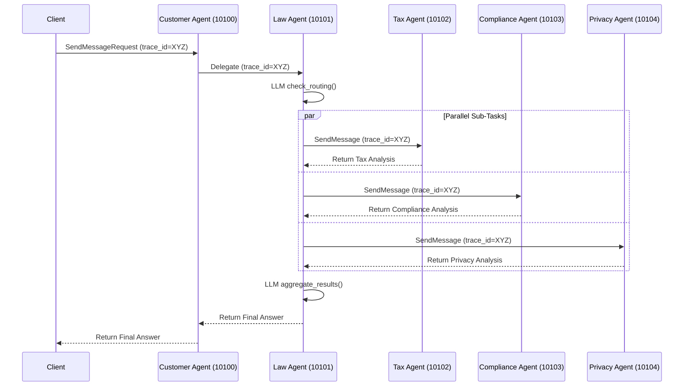

# Câu trả lời bài tập lý thuyết - Codelab Day 9

## Phần 1: Direct LLM Calling

**1. LLM được khởi tạo như thế nào?**
LLM được khởi tạo thông qua hàm `get_llm()` (được import từ `common.llm`). Hàm này gọi class `ChatOpenAI` nhưng được "bẻ lái" trỏ `openai_api_base` về `https://openrouter.ai/api/v1`. Cách này giúp dùng LangChain chuẩn của OpenAI nhưng lại chạy được mọi model (Claude, Gemini, Llama...) qua nền tảng OpenRouter.

**2. Message được gửi đến LLM có cấu trúc gì?**
Cấu trúc là một List (danh sách) gồm 2 thành phần chính: `[SystemMessage(...), HumanMessage(...)]`.

**3. Tại sao cần có SystemMessage và HumanMessage?**
- `SystemMessage`: Đóng vai trò cài đặt bối cảnh, định hình persona (ví dụ: "Bạn là chuyên gia pháp lý..."), và giới hạn quy tắc ("trả lời dưới 300 chữ").
- `HumanMessage`: Là câu hỏi hoặc prompt trực tiếp từ người dùng. Việc tách biệt giúp LLM hiểu đâu là luật/hướng dẫn của hệ thống, và đâu là dữ liệu đầu vào của người dùng.

---

## Phần 2: LLM + RAG & Tools

**1. Hàm `@tool` decorator được dùng ở đâu?**
Được dùng ngay trên dòng định nghĩa các hàm Python (như `def search_legal_database`, `def calculate_damages`). Decorator này (của thư viện LangChain) giúp biến một hàm Python bình thường thành một "công cụ" mà AI có thể hiểu được tên hàm, công dụng (thông qua docstring) và các tham số truyền vào.

**2. `LEGAL_KNOWLEDGE` được cấu trúc như thế nào?**
Nó là một List (danh sách) chứa các Dictionary (từ điển). Mỗi phần tử đại diện cho một mẩu kiến thức pháp luật và gồm 3 trường chính: 
- `id`: Mã định danh.
- `keywords`: Danh sách các từ khóa liên quan để thuật toán search dễ tìm.
- `text`: Nội dung chi tiết của điều luật hoặc án lệ.

**3. LLM được bind với tools ra sao? (Tìm `.bind_tools()`)**
Thông qua phương thức `llm_with_tools = llm.bind_tools(TOOLS)`. Quá trình "bind" này sẽ gửi toàn bộ danh sách Tools (bao gồm tên, mô tả, cấu trúc tham số) vào API của OpenRouter/LLM để LLM biết nó hiện đang sở hữu những công cụ nào trong tay.

---

## Phần 5: Distributed A2A System

**Bài Tập 5.1: Trace request flow (Sequence Diagram)**
Nhờ cơ chế `trace_id` của chuẩn A2A, chúng ta có thể vẽ chính xác đường đi của request qua các Agent như sau:

**Bài Tập 5.2: Test dynamic discovery (Dừng Tax Agent)**
- **Hiện tượng**: Khi ấn `Ctrl+C` để tắt Tax Agent và chạy lại `test_client.py`, hệ thống sẽ trả về lỗi `httpx.ConnectError` (Connection refused) trên màn hình log của **Law Agent** khi cố gắng gọi tới cổng `10102`.
- **Cách hệ thống xử lý**: Do A2A Client gọi qua HTTP thông thường, nếu một Agent (như Tax) bị sập, các Agent gọi đến nó (Law) sẽ văng Exception và kịch bản song song bị gián đoạn.
- **Bài học**: Trong môi trường Production, để fault-tolerant tốt hơn, Law Agent cần có cơ chế Try-Catch khi gọi Sub-Agent: nếu Sub-Agent sập thì Law Agent vẫn có thể bỏ qua phần đó (trả về "Hiện không có chuyên gia thuế để giải đáp") và tiếp tục hoàn thành các phần còn lại, tránh làm sập toàn bộ hệ thống.

---

## Phần 6: Tổng Kết & Mở Rộng

**1. Khi nào nên dùng single agent thay vì multi-agent?**
- Nên dùng Single Agent khi: Bài toán chỉ xoay quanh một nghiệp vụ chuyên môn duy nhất, luồng xử lý (workflow) ngắn, cần tiết kiệm chi phí gọi API (Tokens) và thời gian phản hồi (Latency) cực nhanh.
- Không nên dùng khi: Bài toán yêu cầu kiến thức ở nhiều lĩnh vực khác nhau. Nếu nhồi nhét tất cả Prompt và Tools vào một Agent duy nhất, nó sẽ bị "loạn não", tốn quá nhiều Token context window, dễ sinh ảo giác (hallucination) và gọi nhầm công cụ.

**2. Ưu điểm của A2A protocol so với gRPC hoặc REST thông thường?**
- Truyền tải Context dễ dàng: A2A có các trường chuẩn hóa như `trace_id` (theo dõi log xuyên suốt) và `context_id` (mang theo memory/lịch sử chat).
- Chuẩn hóa thông điệp: Có sẵn định dạng `AgentCard` để các Agent tự khai báo tên và kỹ năng.
- Hướng tới đàm phán tự động: Không chỉ gọi API thụ động như REST, chuẩn A2A giúp các Agent có thể hỏi ngược lại nhau, trao đổi và tự quyết định xem có nhận xử lý task hay không dựa trên AgentCard.

**3. Làm thế nào để prevent infinite delegation loops trong A2A?**
- Cần sử dụng tham số `delegation_depth` (Độ sâu ủy quyền). Mỗi lần một Agent chuyển tiếp câu hỏi cho Agent khác, `depth` sẽ tăng lên +1.
- Cấu hình một biến `MAX_DELEGATION_DEPTH` (ví dụ = 3). Nếu độ sâu chạm ngưỡng này, hệ thống sẽ tự động chặt đứt chuỗi gọi, yêu cầu AI hiện tại phải tự đưa ra câu trả lời thay vì đẩy việc tiếp.

**4. Tại sao cần Registry service? Có thể hardcode URLs không?**
- Hoàn toàn CÓ THỂ hardcode URLs (như ghi thẳng `http://localhost:10102` vào code).
- Tuy nhiên KHÔNG NÊN làm thế và cần Registry vì:
  - Khả năng mở rộng (Scalability): Registry giúp Load Balancing nếu chạy nhiều bản sao của 1 Agent.
  - Khả năng tự phục hồi (Fault-tolerant): Lỡ Agent đổi Port hoặc IP, toàn bộ hệ thống sẽ sập nếu dùng hardcode. Với Registry, Agent mới bật lên sẽ tự khai báo lại URL, các Agent khác tự động lấy được đường dẫn mới nhất mà không cần sửa code.

---

## Bài Tập Cộng Điểm:

**1. Latency (Tổng thời gian trả lời 1 câu hỏi) là bao nhiêu giây?**
- Trong bài test mới nhất ở chế độ luồng đầy đủ (Full flow qua Customer Agent), tổng thời gian hệ thống trả lời mất **19.76 giây**. Điểm nghẽn lớn nhất là ở `Law Agent` vì nó phải gọi LLM 2 lần tuần tự (1 lần phân tích route, 1 lần tổng hợp) cộng thêm thời gian chờ 2 ông Tax/Privacy Agent chạy ngầm.

**2. Đề xuất phương án giảm latency và Kết quả:**
- **Bypass Customer Agent (Đã áp dụng):** Cho client giao tiếp thẳng với `Law Agent` thông qua `test_client_optimized.py`.
  - **Kết quả:** Sau khi chạy `test_client_optimized.py`, latency giảm từ **19.76s** xuống còn **14.53s** (giảm khoảng 25% độ trễ).
  - **Trade-off (Đánh đổi):** Giảm được latency nhưng mất đi một lớp entry-point/orchestration ở Customer Agent. Nếu sau này cần routing linh hoạt trước khi vào luồng Pháp lý (ví dụ: chuyển sang luồng CSKH thông thường) thì sẽ khó hơn.
- **Streaming Responses (SSE):** Thay vì đợi `aggregate` tổng hợp xong toàn bộ mới trả về, ta có thể stream trực tiếp kết quả của từng chuyên gia về cho client ngay khi chuyên gia đó vừa chạy xong.
- **Sử dụng Model nhỏ hơn cho Router:** Dùng model cực nhẹ và siêu tốc (như `gpt-4o-mini` hoặc `claude-3-haiku`) cho node `check_routing` thay vì dùng model lớn, giúp giảm 2-3 giây thời gian chờ.

---

## Bài Tập Nâng Cao (Tự Học)

**Challenge 1: Thêm memory/conversation history**
- **Mục tiêu:** Giúp Agent có khả năng nhớ ngữ cảnh của các câu hỏi trước đó trong cùng phiên chat.
- **Cách thực hiện:** 
  1. Cập nhật `LegalState` trong `stages/stage_4_milti_agent/main.py` để chứa thêm `chat_history: Annotated[list, add_messages]` thay vì chỉ một trường `question: str`.
  2. Bổ sung `MemorySaver` checkpointer từ LangGraph khi compile đồ thị.
  3. Cập nhật `api.py` và `main.js` (Web UI) để tạo và truyền `thread_id` liên tục cho mỗi yêu cầu, thông qua đó LangGraph sẽ đọc lại lịch sử lưu trong bộ nhớ tạm theo đúng `thread_id`.

**Challenge 2: Add authentication**
- **Mục tiêu:** Thêm API key authentication để bảo vệ các endpoints giao tiếp (A2A) tránh bị gọi trái phép.
- **Cách thực hiện:**
  1. Tạo module `common/auth.py` chứa một FastAPI Middleware, có nhiệm vụ kiểm tra header `Authorization: Bearer <token>`. Nếu token không khớp với `A2A_API_KEY` (hoặc mặc định là `super-secret-key`), request sẽ bị từ chối bằng lỗi `401 Unauthorized` (chỉ ngoại trừ đường dẫn public `/.well-known/agent.json`).
  2. Tại `common/a2a_client.py` (nơi xử lý việc gọi qua lại giữa các Agent), sửa `httpx.AsyncClient` để tự động kẹp header `Authorization` mang đúng Token kể trên vào mọi request.
  3. Áp dụng middleware này cho toàn bộ 5 server (`tax`, `privacy`, `law`, `compliance`, `customer`) bằng cách gọi hàm `apply_auth` ngay sau khi khởi tạo FastAPI app.

**Challenge 3: Implement retry logic**
- **Mục tiêu:** Đảm bảo tính chống chịu lỗi (fault-tolerance) của hệ thống bằng cách tự động thử gọi lại (retry) nếu một Agent bị sập tạm thời hoặc mạng chập chờn.
- **Cách thực hiện:** 
  1. Mở file `common/a2a_client.py`, bên trong hàm `delegate` (chức năng uỷ quyền công việc), em đã gói gọn toàn bộ logic gọi HTTP request vào một vòng lặp `for attempt in range(max_retries)` (mặc định thử tối đa 3 lần).
  2. Áp dụng thuật toán **Exponential Backoff**: Tức là nếu lần 1 thất bại, nó chờ 1 giây rồi gọi tiếp. Lần 2 thất bại chờ 2 giây. Lần 3 thất bại chờ 4 giây. Việc này giúp giảm tải cho server đang hấp hối thay vì spam request dồn dập.
  3. Bắt lỗi `httpx.RequestError` và `httpx.HTTPStatusError` (ví dụ như Connection Refused hoặc Internal Server Error 500) và tiến hành retry. Nếu quá 3 lần vẫn lỗi, hệ thống sẽ log ra lỗi chính thức để Law Agent (hoặc Agent gọi) xử lý.
